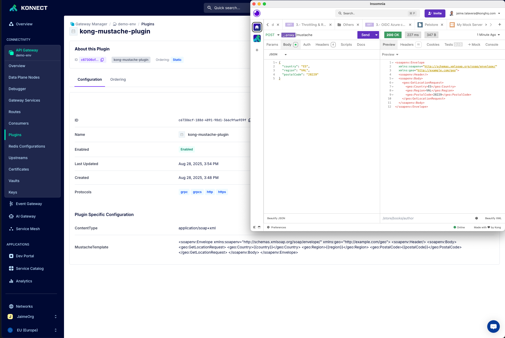

# Readme.md

This repository concerns a custom plugin developed in Lua, which uses the [lustache](https://github.com/Olivine-Labs/lustache) library for making [mustache templating](https://mustache.github.io/).

[Mustache](http://mustache.github.com/) is a logic-less template syntax. It can
be used for simple transformations within the Kong Gateway by using this plugin.

### Installation

As this plugin relies on [luarocks lustache library](https://luarocks.org/modules/luarocks/lustache)
you will need to install first this dependency in your gateway. You can do it by mapping the proper directory into your Kong image, or by simply creating a brand new docker file with the required libraries in it.
There is an example in the `Dockerfile` on this last strategy.

### Usage
Just add the custom plugin `schema.lua` in Konnect, as any other custom plugin and config it. The plugin has two main parameters:

 1. **MustacheTemplate**: You will paste the mustache template you want to use. **[Required]**
 2. **Content-Type**: The expected content-type that the mustache template will produce. By default, it produces `application/json`

### Example

